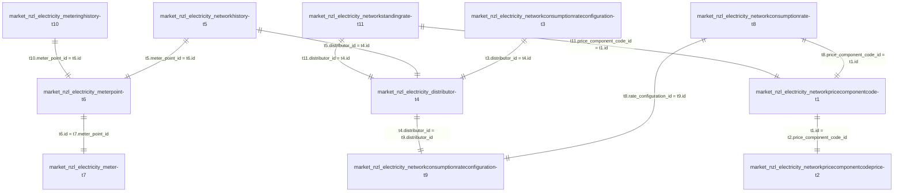

```mermaid
erDiagram
market_nzl_electricity_networkpricecomponentcode-t1 ||--|| market_nzl_electricity_networkpricecomponentcodeprice-t2 : "t1.id = t2.price_component_code_id"

market_nzl_electricity_networkconsumptionrateconfiguration-t3 ||--|| market_nzl_electricity_distributor-t4 : "t3.distributor_id = t4.id"

market_nzl_electricity_networkhistory-t5 ||--|| market_nzl_electricity_distributor-t4 : "t5.distributor_id = t4.id"

market_nzl_electricity_networkhistory-t5 ||--|| market_nzl_electricity_meterpoint-t6 : "t5.meter_point_id = t6.id"

market_nzl_electricity_meterpoint-t6 ||--|| market_nzl_electricity_meter-t7 : "t6.id = t7.meter_point_id"

market_nzl_electricity_networkconsumptionrate-t8 ||--|| market_nzl_electricity_networkpricecomponentcode-t1 : "t8.price_component_code_id = t1.id"

market_nzl_electricity_networkconsumptionrate-t8 ||--|| market_nzl_electricity_networkconsumptionrateconfiguration-t9 : "t8.rate_configuration_id = t9.id"

market_nzl_electricity_distributor-t4 ||--|| market_nzl_electricity_networkconsumptionrateconfiguration-t9 : "t4.distributor_id = t9.distributor_id"

market_nzl_electricity_meteringhistory-t10 ||--|| market_nzl_electricity_meterpoint-t6 : "
t10.meter_point_id = t6.id"

market_nzl_electricity_networkstandingrate-t11 ||--|| market_nzl_electricity_networkpricecomponentcode-t1 : "t11.price_component_code_id = t1.id"

market_nzl_electricity_networkstandingrate-t11 ||--|| market_nzl_electricity_distributor-t4 : "t11.distributor_id = t4.id"
```