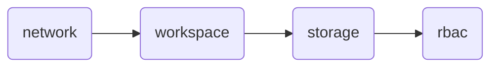

# databricks_infra

## This Branch
This branch will build a azure serverless 4 workspace databricks data platform. The terraform code is split into seperate "code bases" for each type of infrastructure which is easily extendable when new or additional infrastructure is required.

The seperate code bases do have dependencies on each other when building the infrastructure for the first time.




## Getting Started
After cloning this repository check the below dependencies then follow the steps below.

### Dependencies
- terraform cli installed
- azure cli installed
- shared resources resource group is created with a storage account and container available to write terraform state to.
- service principal created with appropriate subscription permissions (Contributor, Role Based Access Control Administrator) and shared storage account permissions (Storage Blob Contributor)
- a storage account with hierarchical namespace enabled exists and a has a container
- metastore is created in databricks account console and is linked to the above storage account
- service principal has "CREATE EXTERNAL LOCATION" on metastore.
- a user created in your entra (or could be your own) who will be the administrator over the data platform

### Build infra

>NOTE: the below steps assume you are building the non-prod environment using the network module.

>NOTE: below are generic. See next section for module specific steps where different from generic steps.

1. change directory into module you want to run e.g. from repo root 
```bash 
cd main/network
```
2. create files filling in the values before running the `echo` command.
```bash 
echo '
databricks_account_id   = ""
subscription_id         = ""
client_id               = ""
client_secret           = ""
tenant_id               = ""' >> .tfvars
```
```bash 
echo '
terraform {
  backend "azurerm" {
    resource_group_name   = ""
    storage_account_name  = ""
    container_name        = ""
    key                   = ""
    subscription_id       = ""
    client_id             = ""
    client_secret         = ""
    tenant_id             = ""
  }
}' >> backend.tf
```
>NOTE: remember to rename the key for each module and each environment. e.g `non-prod-workspace.tfstate`
3. use the azure cli to login
```bash 
az login --service-principal --username <value> --password <value> --tenant <value>
```

4. run the below terraform commands one at a time (or as needed)
```bash 
terraform init
```
```bash 
terraform plan -var-file=<(cat .tfvars ../config/non-prod/network-non-prod.tfvars) -out=tf.plan
```
```bash 
terraform apply tf.plan
```
```bash 
terraform destroy -var-file=<(cat .tfvars ../config/non-prod/network-non-prod.tfvars)
```

### Module Specific
#### workspace
```bash 
echo '
databricks_account_id   = ""
subscription_id         = ""
client_id               = ""
client_secret           = ""
tenant_id               = ""
admin_user_id           =' >> .tfvars
```
#### storage
```bash 
echo '
databricks_account_id   = ""
subscription_id         = ""
client_id               = ""
client_secret           = ""
tenant_id               = ""
main/storage/.tfvars    = ""' >> .tfvars
```